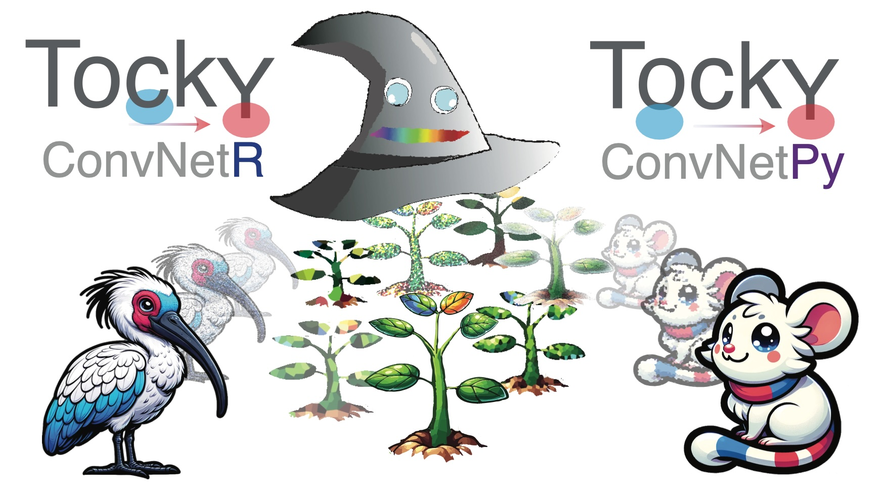
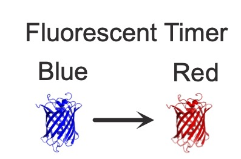
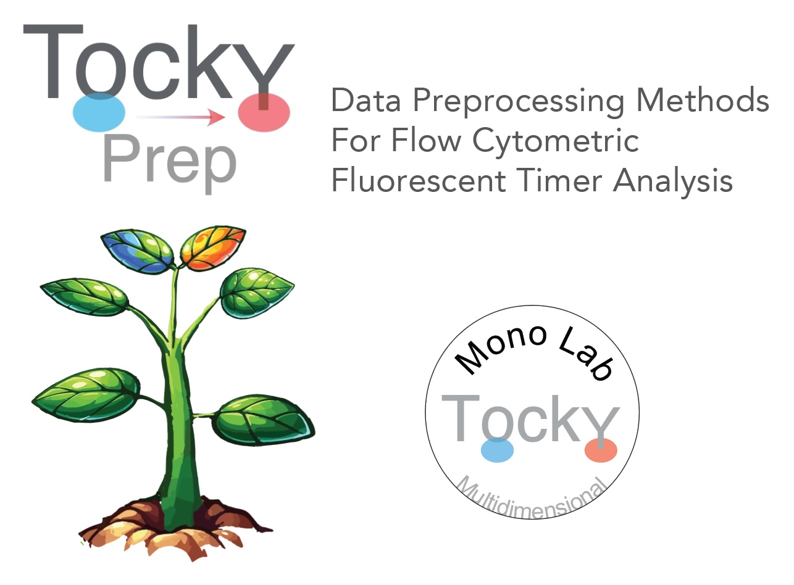
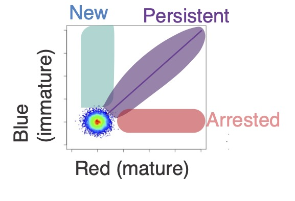
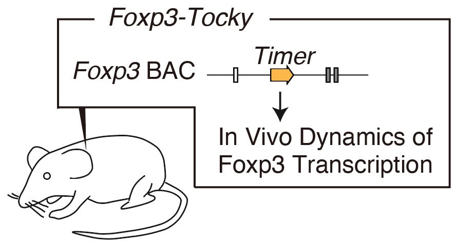

# TockyMachineLearning: Machine Learning Toolkit for Single Cell Cytometric Data using Fluorescent Timer (Beta Version)

**Author:** Dr. Masahiro Ono  
**Date:** 19 February 2025

# 1. Introduction to TockyMachineLearning Package Suite

The **TockyMachineLearning** package suite comprises several subpackages designed to facilitate advanced machine learning analyses of flow cytometric data from Fluorescent Timer reporters. Each package within the suite specializes in different aspects of data handling and analysis:

## TockyRandomForest

- **TockyRandomForest**: An R package that provides Random Forest analysis tools specifically tailored for processing and interpreting Fluorescent Timer data.

  
  
## TockyConvNet (TockyCNN)

The **TockyConvNet** Approach is achieved by the integrated workflow through the use of **TockyConvNetR** and **TockyConvNetPy**.

  

  
- **TockyConvNetR**: An R package focused on data preprocessing and feature cell analysis suitable for Convolutional Neural Network (ConvNet) analyses. This package facilitates image conversion methods for preparing Tocky data and implements Inverse GradCAM Gating Analysis to interpret ConvNet/Grad-CAM outputs.

- **TockyConvNetPy**: A Python package dedicated to performing ConvNet training and conducting Grad-CAM analysis, complementing the R-based preprocessing and analysis tools.

# 2. Workflow

Below is a schematic figure providing an overview of the workflows and interactions within the **TockyMachineLearning** suite.

### Link to GitHub Pages:

  

    <h3>TockyRandomForest</h3>
    

	
	

  

  

    <h3>TockyConvNetR</h3>
    

	
	

  

  

    <h3>TockyConvNetPy</h3>
    

	
	

  

## 3. Principles of Tocky

### The Use of Fluorescent Timer Protein for Investigating Transcriptional and Cellular Dynamics

The foundational concept behind the Tocky technology was introduced by the Ono lab in 2018 (Bending et al., 2018). To measure time-dependent processes in individual T cells **in vivo**, Dr. Masahiro Ono envisioned using a substance capable of encoding time information through its known kinetics. Through screening experiments, the mCherry mutant Fluorescent Timer protein, **fast-FT**, emerged as an ideal candidate, especially for its compatibility with flow cytometry.

Originally developed by the Verkhusha group at Einstein (Subach et al., 2009), the Fluorescent Timer protein is unique in its ability to spontaneously change its emission spectrum in known kinetics. Leveraging this feature, the Ono lab has developed the integrated experimental and computationl toolkit, Tocky, which uses Fluorescent Timer reporter transgenic and computational algorithms to analyse Timer fluorescence data. for analyzing T cell activities and differentiation *in vivo* (Bending et al., 2018).

  

The Fluorescent Timer protein undergoes a spontaneous and irreversible transition in its emission spectrum, shifting from blue fluorescence to red fluorescence after translation.

Our empirical observations have revealed that the half-life of the blue fluorescence (Timer-Blue) is approximately 4 hours, while the half-life of the red fluorescence (Timer-Red) extends to about 120 hours (Bending et al., 2018).

Note: **Tocky** is inspired by the Japanese word "toki," meaning "time." It serves as a comprehensive toolkit that merges experimental and computational approaches to analyze the temporal dynamics of cell differentiation and activation in vivo.

### 👉 Read our landmark paper for the Tocky technology:

Bending D, Prieto Martín P, Paduraru A, Ducker C, Marzaganov E, Laviron M, Kitano S, Miyachi H, Crompton T, Ono M. (2018) _A timer for analyzing temporally dynamic changes in transcription during differentiation in vivo_. J Cell Biol. Aug 6;217(8):2931-2950. [doi: 10.1083/jcb.201711048.](https://rupress.org/jcb/article/217/8/2931/39442/A-timer-for-analyzing-temporally-dynamic-changes) Epub 2018 Jun 25. PMID: 29941474; PMCID: PMC6080944.

## 4. Data Preprocessing: Timer Normalisation and Transformation

The primary objective of the Tocky approach is to analyze the time-related information captured in the profiles of Timer-Blue and Timer-Red fluorescence data at the individual cell level. 

To optimally utilize this temporal information in single-cell analysis, we have introduced a novel concept along with appropriate algorithms. These tools are designed to normalize and transform Timer fluorescence data into two key metrics: *Timer Angle* and *Timer Intensity*.

*Timer Angle* is defined as the angle (in degrees, ranging from 0 to 90) measured from the Timer-Blue axis. *Timer Intensity* represents the distance (or *norm*) from each cell to the origin (where Timer-Blue = Timer-Red = 0).

  
  

In this framework, normalized and transformed Timer fluorescence data are termed as *Tocky data*. This data set offers a unique temporal profile that includes both *real-time* transcriptional activities and *cumulative* (historical) activities observed in the days leading up to the experimental analysis of cells.

### Importance of TockyPrep in TockyMachineLearning Applications.

The Tocky data preprocessing is essential for the use of TockyMachineLearning methods. Methods for Tocky data preprocessing are implemented in the R package [**TockyPrep**](https://monotockylab.github.io/TockyPrep/). Visit [the GitHub page for TockyPrep](https://monotockylab.github.io/TockyPrep/).

### 👉 Read our paper on the data preprocessing method TockyPrep:

Masahiro Ono (2025). _TockyPrep: Data Preprocessing Methods for Flow Cytometric Fluorescent Timer Analysis._ BMC Bioinformatics. 2025 Feb 8;26(1):44. [doi: 10.1186/s12859-025-06058-8](https://bmcbioinformatics.biomedcentral.com/articles/10.1186/s12859-025-06058-8).

Masahiro Ono (2024). _TockyPrep: Data Preprocessing Methods for Flow Cytometric Fluorescent Timer Analysis._ arXiv:2411.04111 [q-bio.QM]. Available at:[https://arxiv.org/abs/2411.04111](https://arxiv.org/abs/2411.04111).

## 5. Data Categorisation by TockyLocus

We introduced the concept of **Tocky Locus**, which classifies the Tocky Angle into three distinct loci: **New**, **Persistent**, and **Arrested**, along with two intermediate loci, **New-to-Persistent (NPt)** and **Persistent-to-Arrested (PAt)** (Bending et al., 2018). The concept of TockyLocus is to provide a working framework to associate Tocky data and transcriptional dynamics in a streamlined way.

  

### 👉 Read our paper on the TockyLocus methods:

Masahiro Ono (2024). *TockyLocus: Quantitative Analysis Methods for Flow Cytometric Fluorescent Timer Data.* arXiv:2411.09386 [q-bio.QM]. Available at:[https://arxiv.org/abs/2411.04111](https://arxiv.org/abs/2411.09386).

## 6. Tocky Mouse Development

### Nr4a3-Tocky

**Nr4a3** was identified as an immediate early gene downstream of T-cell receptor (TCR) signaling through Canonical Correspondence Analysis (CCA), a form of multidimensional transcriptomic analysis (Ono et al., 2013; Ono et al., 2014).

Utilizing CCA, a cross-analysis of two datasets was conducted to pinpoint the intersection of thymic T cell transcriptomes—representative of in vivo TCR signaling—with peripheral activated T cell transcriptomes, which indicate in vitro TCR signaling. The objective was to ascertain genes downstream of TCR signaling. **Nr4a3** emerged as the top-ranked gene (Bending et al., 2018).

**Nr4a3** is not present in resting T-cells. However, following activation by TCR signaling, Nr4a3 mRNA levels surge rapidly. This characteristic facilitated the creation of an Nr4a3 Fluorescent Timer reporter mouse strain, enabling the analysis of the temporal dynamics of T cells activated post antigen recognition.

### 👉 Read our landmark paper for Nr4a3-Tocky:

Bending D, Prieto Martín P, Paduraru A, Ducker C, Marzaganov E, Laviron M, Kitano S, Miyachi H, Crompton T, Ono M. (2018) _A timer for analyzing temporally dynamic changes in transcription during differentiation in vivo_. J Cell Biol. Aug 6;217(8):2931-2950. [doi: 10.1083/jcb.201711048.](https://rupress.org/jcb/article/217/8/2931/39442/A-timer-for-analyzing-temporally-dynamic-changes) Epub 2018 Jun 25. PMID: 29941474; PMCID: PMC6080944.

### Foxp3-Tocky

  

Establishing the proof of concept for the Tocky system using Nr4a3-Tocky, we further developed a new Tocky mouse strain for analyzing temporal dynamics of Foxp3 transcription. Foxp3 controls the differentiation and function of regulatory T cells.

### 👉 Read our first paper dedicated to Foxp3-Tocky

Bending D, Paduraru A, Ducker CB, Prieto Martín P, Crompton T, Ono M. A temporally dynamic Foxp3 autoregulatory transcriptional circuit controls the effector Treg programme. EMBO J. 2018 Aug 15;37(16):e99013. [doi: 10.15252/embj.201899013](https://www.embopress.org/doi/full/10.15252/embj.201899013). Epub 2018 Jul 10. 

## 4. TockyMachineLearning: A Toolkit for Tocky Analysis

  

The **TockyMachineLearning** toolkit offers a comprehensive suite of tools designed for the analysis of Tocky data, particularly focusing on T-cell data derived from Foxp3-Tocky mice, using machine learning methods. 

## The Ono Lab (MonoTockyLab)

**The Masahiro Ono Lab (MonoTockyLab)** offers innovative approaches to analyzing omics and flow cytometric data. The lab is particularly well-known for their development of Timer-of-cell-kinetics-and-Activity (**Tocky**) and integrated analysis of immunological data using both experiments and computational analysis.

**Principal Investigator**: Dr. Masahiro Ono, Reader in Immunology at Imperial College London.

Dr. Ono is **the creator and developer of Tocky**. He innovated the transgenic and computational technologies that constitute Tocky.

In 2008, Dr. Ono initiated his pioneering transition from molecular immunology to becoming an **Integrated Experimental and Computational Immunologist**, demonstrating his visionary leadership and pioneering spirit in the development and application of multidimensional analysis and computational methods to address experimental and immunological problems. Tocky represents one of the fusion technologies that Dr. Ono has both created and developed.

Tocky employs the Fluorescent Timer protein to analyze the temporal dynamics of cell activities and development _in vivo_. His lab integrates molecular biology, immunology, and computational analysis to develop novel research tools, thereby enhancing the understanding of immune cell biology.

## Contact and More

**Email**:

**Personal Homepage**:

**GitHub**:

**Twitter**:

**BlueSky**:

**Professional Homepage**: [Imperial College London - Masahiro Ono](https://www.imperial.ac.uk/people/m.ono)

## Reference
Subach F.V., Subach O.M., Gundorov I.S., Morozova K.S., Piatkevich K.D., Cuervo A.M., and Verkhusha V.V. (2009). _Monomeric fluorescent timers that change color from blue to red report on cellular trafficking._ [Nat Chem Biol 5, 118-126. 10.1038/nchembio.138.](https://www.nature.com/articles/nchembio.138) 

**Ono M**, Tanaka RJ, Kano M, Sugiman T. _Visualising the cross-level relationships between pathological and physiological processes and gene expression: analyses of haematological diseases_. [PLoS One. 2013;8(1):e53544. doi: 10.1371/journal.pone.0053544.](https://dx.plos.org/10.1371/journal.pone.0053544)

**Ono M.**, Tanaka R.J., and Kano M. (2014). _Visualisation of the T cell differentiation programme by Canonical Correspondence Analysis of transcriptomes_. [BMC genomics 15, 1028. 10.1186/1471-2164-15-1028.](https://bmcgenomics.biomedcentral.com/articles/10.1186/1471-2164-15-1028)

Bending D., Martín P.P., Paduraru A., Ducker C., Marzaganov E., Laviron M., Kitano S., Miyachi H., Crompton T., and **Ono M**. (2018). _A timer for analyzing temporally dynamic changes in transcription during differentiation in vivo._ [Journal of Cell Biology 217, 2931-2950.] (https://rupress.org/jcb/article/217/8/2931/39442/A-timer-for-analyzing-temporally-dynamic-changes)

Bending D, Paduraru A, Ducker CB, Prieto Martín P, Crompton T, **Ono M**. _A temporally dynamic Foxp3 autoregulatory transcriptional circuit controls the effector Treg programme._ [EMBO J. 2018 Aug 15;37(16):e99013. doi: 10.15252/embj.201899013.](https://www.embopress.org/doi/full/10.15252/embj.201899013)

**Ono M** (2024). _TockyPrep: Data Preprocessing Methods for Flow Cytometric Fluorescent Timer Analysis._ arXiv:2411.04111 [q-bio.QM]. Available at:[https://arxiv.org/abs/2411.04111](https://arxiv.org/abs/2411.04111).

**Ono M** (2024). *TockyLocus: Quantitative Analysis Methods for Flow Cytometric Fluorescent Timer Data.* arXiv:2411.09386 [q-bio.QM]. Available at:[https://arxiv.org/abs/2411.04111](https://arxiv.org/abs/2411.09386).

**Ono M** (2025). _TockyPrep: Data Preprocessing Methods for Flow Cytometric Fluorescent Timer Analysis._ BMC Bioinformatics. 2025 Feb 8;26(1):44. [doi: 10.1186/s12859-025-06058-8](https://bmcbioinformatics.biomedcentral.com/articles/10.1186/s12859-025-06058-8).

